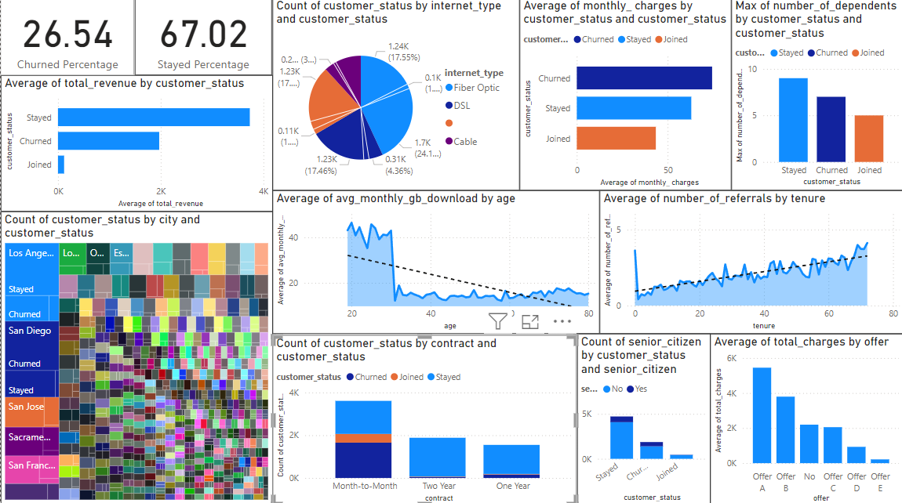

# Telco Customer Churn Analysis and Prediction
 
 

# FEW ANALYSIS RESULTS:
 
&emsp;26.54% of Customers Churned
&emsp;67.02% of Customers Stayed
&emsp;6.44% of Customers Joined
&emsp;So most customers opted to Stay.

&emsp;Average of Total revenue was highest and received from Customers who stayed (3735.68)
&emsp;Average of Total revenue for Customers who Churned was between that of from Customers who joined and Stayed (1971.35)
&emsp;Average of Total revenue was lowest and received from Customers who joined (119.35)
&emsp;So most revenue was from the customers who stayed followed by customers who churned.

&emsp;The highest number of Customers who Stayed from the Los Angeles (197) and the lowest was from El Sobrante (3)
&emsp;The highest number of Customers who Churned from the San Diego (185) and the lowest was from El Sobrante, Edwards, Dunlap, Dixon, Cutler, Cool, Echo Lake, Browns Valley (1)
&emsp;The highest number of Customers who Joined from the Los Angeles (18) and the lowest was from El Nido, El Dorado Hills, Crows Landing, Colusa (1).
&emsp;So Customers from Los Angeles were the most probable to stay and also to join whereas Customers from San Diego are more likely to churn compared to the other cities.

&emsp;Highest number of customers opted for Fibre Optic (43.09%) followed by DSL(23.46%),None(21.67%) and Cable(11.8%).
&emsp;In customers who opted for Fibre Optic out of the 43.09%: 24.11% Stayed, 17.55% Churned ,1.43% Joined.
&emsp;In customers who opted for DSL out of the 23.46%: 17.46% Stayed, 4.36% Churned ,1.63% Joined.
&emsp;In customers who opted for None out of the 21.67%: 17.48% Stayed, 1.6% Churned ,2.58% Joined.
&emsp;In customers who opted for Cable out of the 11.8%: 7.97% Stayed, 3.02% Churned ,0.8% Joined.
&emsp;So Customers who opted for DSL were most probable to Stay (74.42%) and Customers who opted for Fibre Optic were most probable to Churn (40.72%)

&emsp;Churned Customers had the average monthly charges(74.44) followed by Customers who stayed (62.98) and Customers who joined had lowest(43.47).

&emsp;Customers who stayed had the maximum number of dependents(9) followed by Customers who churned (7) and Customers who joined (5).
&emsp;So Customers who had high number of dependents are more likely to stay.

&emsp;Average monthly downloads(GB) is highest for the customers who's age is 20 (46.41 GB) and it is lowest for customers with age of 58 (12.09 GB). There is a noticeable &emsp;decline in the downloads as the age of the customers increases.

&emsp;Tenure of 72 had an average of 4.13 referrals whereas tenure of 1 had an average of 0.41 referrals. There is a steady increase in the referrals as the tenure increases.

&emsp;Customers who had used offer A(5446.13) had highest average total charges whereas offer E(215.54) had the lowest.
&emsp;The customers who had no offers had the average total charges of 2196.61 which was somewhat in the middle of the extremes. 
&emsp;So customers who use offer A are likely to have high total charges whereas customers who use offer E could have the lowest.

&emsp;Highest number of senior citizens opted to stay(55.67%) whereas 41.68% of senior citizens were churned and 2.62% joined.

&emsp;Highest percentage of customers who churned belonged to Month-to-Month contract (88.5%) whereas the lowest percentage of customers who churned belonged to Two Year (2.56%).
&emsp;Customers who opted Two Year contract had highest probability of staying (96.28%).
&emsp;Customers who opted for Month-Month had lowest probability of staying (42.85%).
&emsp;So customers who opted for Two Year or One Year contract had more chances of staying compared to Month-to-Month.
